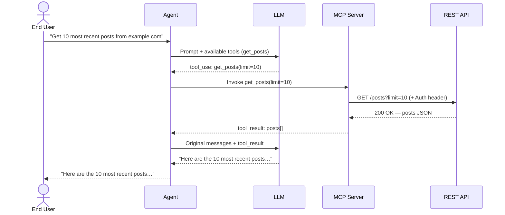

This blog is more for me than for others. It contains my thoughts as I learnt more about MCP servers this month.

## Background

I have understood conceptually the idea of MCP since the term first went viral about a year ago, but today I decided to analyse how the MCP flow really works under the hood. Here is what I discovered.

## The Flow

The thing I always have to remind myself is that LLMs are just language models. They take in a prompt and then spit out some text. They are not in themselves able to make API requests, read files, store files, or run compute jobs.

The architecture that has emerged to address this is an AI agent — sometimes called an AI assistant — that sits between the end user and the LLM and does the heavy lifting on the LLM's behalf.

Let's say I ask my AI agent to read and synthesise a report on the last 10 blog posts on example.com. The agent takes this prompt and forwards it to the LLM, but it also sends over a list of available tools that the LLM can ask the agent to use.

### What Are These Tools?

The easiest way to think of a tool is as a wrapper around an individual REST endpoint. To get the last 10 blog posts from example.com, it would likely be an endpoint like `GET /posts?limit=10`.

The owners of example.com (or anyone else who can use the example.com API) can build an MCP server that exposes each HTTP endpoint as a named tool for LLMs to call. The LLM never sees the HTTP details — it just sees a tool called `get_posts` with a description and an input schema.

### Back to the Flow

The LLM receives the prompt alongside the list of available tools. Rather than answering directly, it responds with a structured tool call — not a response for the end user, but an instruction to the agent to invoke a specific tool:

```json
{
  "type": "tool_use",
  "id": "toolu_01abc",
  "name": "get_posts",
  "input": {
    "limit": 10
  }
}
```

The agent, which has the ability to make network requests on behalf of the LLM, invokes the relevant tool. This hits the MCP server, which in turn makes the underlying HTTP request and returns the result to the agent, which passes it back to the LLM.

The LLM can then reason over the results — reading the latest 10 posts, synthesising them, and returning a response to the end user via the agent.



## What comes next

While this basic flow is well trodden and much written about, fast forward to 2026 and there are obvious new areas of discussion, debate and progress. Below are a few areas I am looking into.

### MCP Auth
Firstly, what if an auth protected MCP server allows multiple (untrusted) MCP clients to make requests to it. Then there needs to be some authentication flow between the MCP client and MCP server. The spec recently added OAuth 2.1 support for MCP client-to-server auth. The community is actively debating how to handle multi-tenant MCP servers where different users have different credentials. This is unsolved and under active development.

### MCP registries
We glossed over ther fact that the AI agent just knows all the tools which it can give to the LLM. How does it learn about available tools and MCP servers? There's a race to build npm-style registries for MCP servers. Who wins this becomes important infrastructure.

### Agent-to-agent via MCP
So far we have discussed using MCP to wrap around REST APIs. But what if instead they could let one AI agent call another as a tool. This is where things get architecturally interesting!